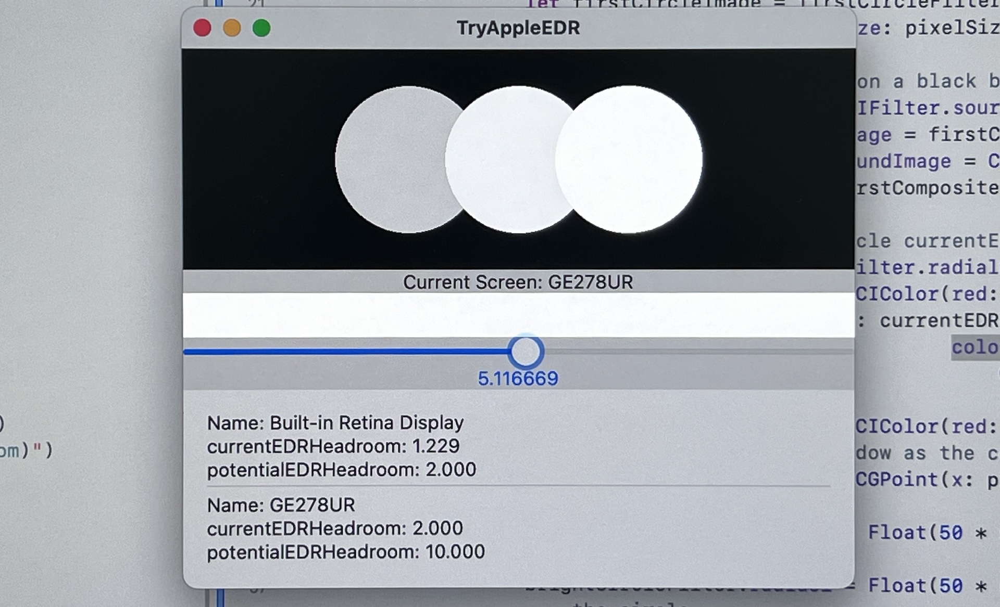

# TryAppleEDR

I recently tried using Core Image, Metal to create HDR content in SwiftUI, which is what I discovered.

In the [Apple Core Image Sample Code](https://developer.apple.com/documentation/coreimage/generating_an_animation_with_a_core_image_render_destination) example, HDR is effective on my Macbook Pro, but not on my iPhone 13 Pro. Ultimately, I discovered that the currentEDRHeadroom used in iOS does not return the value that I assumed would change "according to the current user screen brightness". Using potentialEDRHeadroom can display content with high brightness.

To further verify, I created this project.

This project can help you verify whether your device supports EDR, as well as the effects of currentEDRHeadroom and potentialEDRHeadroom.



I created three circles, using 1.0, currentEDRHeadroom, and potentialEDRHeadroom as brightness values, and then rendered them to the screen using Metal.

On the built-in display of the Macbook Pro (M1 chip), the brightness of currentEDRHeadroom changes with the adjustment of screen brightness. The effect of potentialEDRHeadroom is high brightness, but the difference is not significant. However, on an external display with a higher brightness limit, a significant difference can be seen.

On the iPhone 13 Pro, currentEDRHeadroom = 1.0, and the effect of potentialEDRHeadroom is high brightness.

I also created a rectangle and a Slider that can help you adjust the brightness value for better observation of the effects.

## Adapting to EDR

You can view my source code, the following is the key.

### layer settings

1. Use CAMetalLayer wantsExtendedDynamicRangeContent and set to true.
2. Use supported pixel formats and color spaces

```swift
if let layer = view.layer as? CAMetalLayer {
    // Enable EDR with a color space that supports values greater than SDR.
    layer.wantsExtendedDynamicRangeContent = true
    layer.colorspace = CGColorSpace(name: CGColorSpace.extendedLinearDisplayP3)
    layer.pixelFormat = MTLPixelFormat.rgba16Float
    // Ensure the render view supports pixel values in EDR.
    view.colorPixelFormat = MTLPixelFormat.rgba16Float
}
```

### Leverage EDR headroom

```swift
// Define the size of the square
let pixelSize = CGSize(width: windowSize.width * scaleFactor, height: windowSize.height * scaleFactor)
// Create a rounded rectangle
let roundedRectangleGenerator = CIFilter.roundedRectangleGenerator()
roundedRectangleGenerator.color = CIColor(red: headroom, green: headroom, blue: headroom, colorSpace: CGColorSpace(name: CGColorSpace.extendedLinearDisplayP3)!)!
roundedRectangleGenerator.extent = CGRect(origin: .zero, size: pixelSize)
roundedRectangleGenerator.radius = 0
return roundedRectangleGenerator.outputImage!
```

### Better way to get headroom

```swift
var headroom = 1.0
#if os(macOS)
    if screen!.maximumExtendedDynamicRangeColorComponentValue > 1.0 {
        headroom = screen!.maximumExtendedDynamicRangeColorComponentValue
    } else {
        headroom = screen!.maximumPotentialExtendedDynamicRangeColorComponentValue
    }
#else
if screen!.currentEDRHeadroom > 1.0 {
        headroom = screen!.currentEDRHeadroom
    } else {
        headroom = screen!.potentialEDRHeadroom
    }
#endif
```

## Overview of Apple EDR

You can view the 6:25 section of the video [Explore EDR on iOS](https://developer.apple.com/videos/play/wwdc2022/10113/) to understand the concept of Apple EDR.

"Headroom" refers to the ratio of the peak brightness of the display to the peak brightness of SDR.

Headroom ≈ Display Peak / SDR

1. Different displays can achieve different maximum brightness, so the Headroom is also different.
2. When the SDR brightness changes, the Headroom will also change. For example, when we adjust the screen brightness, the Headroom will change accordingly.

For example, if I set the display brightness to 100 nit, and the maximum brightness of this display is 1000 nit, then the Headroom is 10. When the display brightness is increased to 200 nit, the Headroom will also become 5.

At the same time, Apple has also introduced a reference mode, which uses the same color gamut and brightness on supported displays, so that when viewing the same content on different devices, it can maintain a consistent display effect. The reference mode fixes the SDR peak brightness at 100 nits, the HDR peak brightness at 1000 nits, and the Headroom at 10.

## Some Links

- [Explore EDR on iOS](https://developer.apple.com/videos/play/wwdc2022/10113/)
- [Apple Core Image Sample Code](https://developer.apple.com/documentation/coreimage/generating_an_animation_with_a_core_image_render_destination)
- [Display EDR content with Core Image, Metal, and SwiftUI](https://developer.apple.com/videos/play/wwdc2022/10114/)
- [Determining Support for EDR Values](https://developer.apple.com/documentation/metal/hdr_content/determining_support_for_edr_values)
- [Discover Reference Mode](https://developer.apple.com/videos/play/tech-talks/110337/)